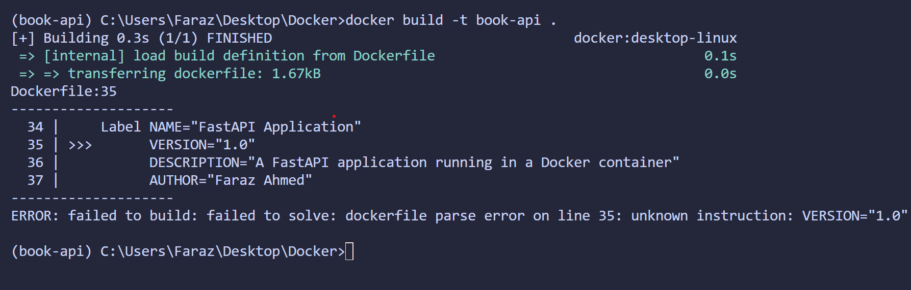
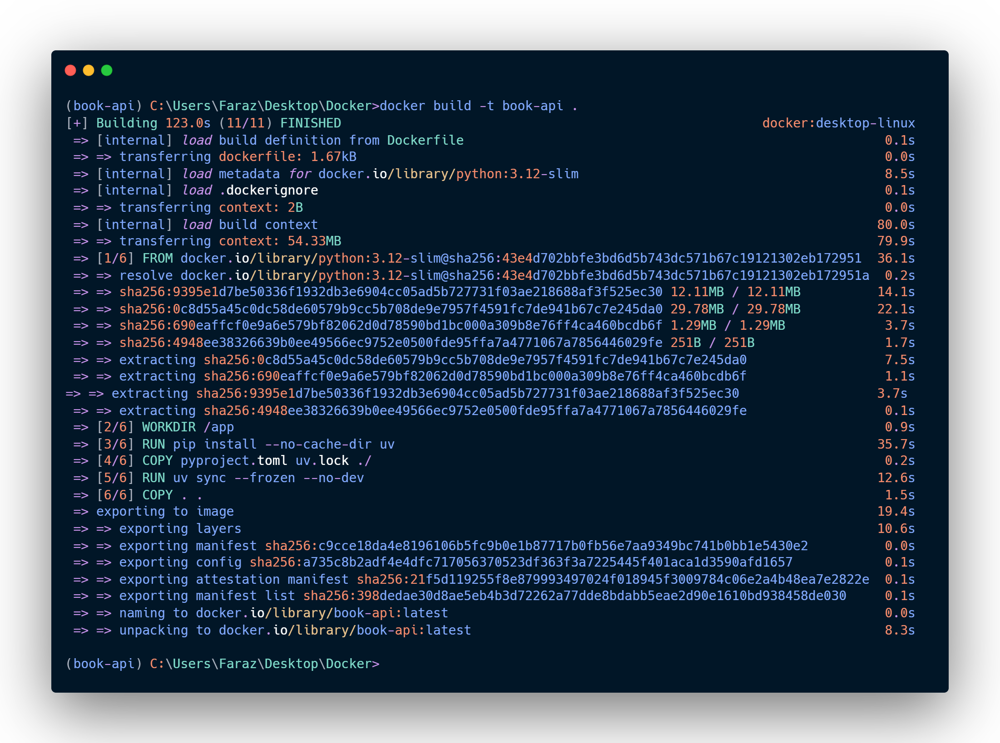

# Docker Tutorial: Building and Running the Book API

This guide walks you through converting the Dockerfile into a Docker image and running it as a container.

## Prerequisites

- Docker Desktop installed and running
- Terminal/Command Prompt open in the project directory (`c:\Users\Faraz\Desktop\Docker`)

---

## The Dockerfile

```dockerfile
# Base image - Using slim version of Python 3.12 for smaller image size
FROM python:3.12-slim

# Set working directory inside the container
WORKDIR /app

# Install uv package manager
RUN pip install --no-cache-dir uv

# Copy dependency files first (better Docker cache)
COPY pyproject.toml uv.lock ./

# Install dependencies using uv
RUN uv sync --frozen --no-dev

# Copy application code
COPY . .

# Expose the application port
EXPOSE 8000

# Image metadata
LABEL NAME="FastAPI Application" \
      VERSION="1.0" \
      DESCRIPTION="A FastAPI application running in a Docker container" \
      AUTHOR="Faraz Ahmed"

# Start the application
CMD ["uv", "run", "uvicorn", "app.main:app", "--host", "0.0.0.0", "--port", "8000", "--workers", "4"]
```

**Key Instructions Explained:**

| Instruction | Purpose |
|-------------|---------|
| `FROM` | Specifies the base image (Python 3.12 slim) |
| `WORKDIR` | Sets the working directory inside the container |
| `RUN` | Executes commands during image build |
| `COPY` | Copies files from host to container |
| `EXPOSE` | Documents which port the container listens on |
| `LABEL` | Adds metadata to the image |
| `CMD` | Default command to run when container starts |

---

## Step 1: Verify Docker is Running

```bash
docker --version
```

You should see output like `Docker version 24.x.x` confirming Docker is installed.

---

## Step 2: Build the Docker Image

Run the following command from the project root (where the Dockerfile is located):

1. The `.` is the locate the `Dockerfile`  to build the image from it.
2. the -t is to give a name to the image
3. you can also give a name with tag like `cloud-native-fastapi:dev` to specify the version of the image, if you don't specify the tag it will be tagged as `latest` by default.
4. naming rules for the image name: lowercase letters, numbers, hyphens, and underscores. No spaces or uppercase letters.

```bash
docker build -t book-api .
or 
docker build-t cloud-native-fastapi:dev .
```

**Explanation:**

| Part | Meaning |
|------|---------|
| `docker build` | Command to build an image from a Dockerfile |
| `-t book-api` | Tags/names the image as "book-api" |
| `.` | Build context - current directory containing the Dockerfile |

**Expected output:**

```
[+] Building 45.2s (10/10) FINISHED
 => [internal] load build definition from Dockerfile
 => [1/5] FROM python:3.12-slim
 => [2/5] WORKDIR /app
 => [3/5] RUN pip install --no-cache-dir uv
 => [4/5] COPY pyproject.toml uv.lock ./
 => [5/5] RUN uv sync --frozen --no-dev
 => [6/6] COPY . .
 => exporting to image
 => naming to docker.io/library/book-api
```

---

## Step 3: Verify the Image Was Created

```bash
docker images
```

Look for `book-api` in the list:

```
REPOSITORY   TAG       IMAGE ID       CREATED          SIZE
book-api     latest    abc123def456   10 seconds ago   250MB
```

---

## Step 4: Run the Container

```bash
docker run -p 8000:8000 book-api
```

**Explanation:**

| Part | Meaning |
|------|---------|
| `docker run` | Command to create and start a container |
| `-p 8000:8000` | Maps port 8000 on your machine to port 8000 in the container |
| `book-api` | The image name to run |

---

## Step 5: Access the Application

Open your browser and navigate to:

- **API Root:** <http://localhost:8000>
- **Swagger Docs:** <http://localhost:8000/docs>
- **ReDoc:** <http://localhost:8000/redoc>

---

## Step 6: Stop the Container

Press `Ctrl + C` in the terminal where the container is running.

---

## Additional Commands

### Run in Detached Mode (Background)

```bash
docker run -d -p 8000:8000 --name book-api-container book-api
```

| Flag | Meaning |
|------|---------|
| `-d` | Run in detached/background mode |
| `--name book-api-container` | Assign a name to the container |

### View Running Containers

```bash
docker ps
```

### Stop a Detached Container

```bash
docker stop book-api-container
```

### Remove a Container

```bash
docker rm book-api-container
```

### Remove the Image

```bash
docker rmi book-api
```

### Rebuild After Code Changes

```bash
docker build -t book-api .
docker run -p 8000:8000 book-api
```

---

## Quick Reference

| Action | Command |
|--------|---------|
| Build image | `docker build -t book-api .` or `docker build-t cloudnative-fastapi:dev .`|
| Run container | `docker run -p 8000:8000 book-api` |
| Run in background | `docker run -d -p 8000:8000 --name book-api-container book-api` |
| List images | `docker images` |
| List running containers | `docker ps` |
| List all containers | `docker ps -a` |
| Stop container | `docker stop <container-name>` |
| Remove container | `docker rm <container-name>` |
| Remove image | `docker rmi book-api` |
| View container logs | `docker logs <container-name>` |

## My Docker Image Diagram

## Error Diagram



## Build Image Diagram


